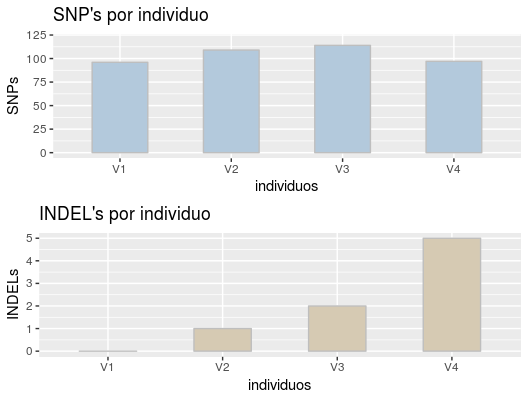

# **Resumen**

Los datos presentes en este trabajo son de transcriptomas de cloroplasto de *Vanila planifolia*. Los cuales se encentran en la carpeta data/input. 

Los datos se corrieron en contenedores de docker, por lo que se montaron volúmenes en la ruta al directorio donde se encuentran (ver scripts). 

Estos datos fueron primeramente visualizados con el software FASTQC y posteriormente  se llevo a cabo el *trimming* y el filtrado de calidad mediante FASTXTOOLS. Para ello, primero se utilizó el comando ```fastx_trimmer -f 2 -l 70``` el cual corta las secuencias del pb 2 al 70. Después, se utilizó el comando ```fastq_quality_filter -q 20 -p 90`` que filtra por la calidad. Estos comandos nos arrojan un nuevo archivo .fastqc.
```
for i in V1 V2 V3 V4; do docker run --rm -v ../data/input:/data biocontainers/fastxtools /bin/bash -c "fastx_trimmer -f 2 -l 70 -i $i.fastq -v | \fastq_quality_filter -q 20 -p 90 -o clean_$i.fastq -v"; done 
```

Una vez teniendo los datos "limpios" proseguimos a mapear al genoma de referencia, el cual se descargó de NCBI con ID KJ566306.1 (genoma completo de cloroplasto de *Vanilla planifolia*). Esto lo hacemos mediante:
```
curl -s "https://eutils.ncbi.nlm.nih.gov/entrez/eutils/efetch.fcgi?db=nucleotide&rettype=fasta&id=KJ566306.1" > ../data/output/KJ566306.fasta
```
Con el software Bowtie2 indexamos la secuencia del genoma de referencia y después mapeamos con el siguiente comando:
```
for i in V1 V2 V3 V4; do docker run --rm -v ../data/output:/data biocontainers/bowtie2 bowtie2 -x KJ566306 -U clean_$i.fastq -S map_$i.sam; done
```

Los resultados obtenidos en el ejercicio anterior fueron transformados en archivos .bam mediante el software Samtools. Para convertir los archivos BAM en posiciones genómicas usamos el comando mpileup para producir un archivo BCF que contiene todas las ubicaciones en el genoma
```
for i in V1 V2 V3 V4; do docker run --rm -v ../data/output:/data biocontainers/samtools samtools mpileup -go map_$i.bcf -f KJ566306.fasta map_$i.sorted.bam; done
```
Posteriormente se hizo el llamado de los SNP's y un estadístico para poder visualizarlo mediante el software Bcftools con los siguientes comandos:
```
for i in V1 V2 V3 V4; do docker run --rm -v ../data/output:/data biocontainers/bcftools bcftools call -vmO z -o map_$i.vcf.gz map_$i.bcf; done

for i in V1 V2 V3 V4; do docker run --rm -v ../data/output:/data biocontainers/bcftools bcftools stats -F KJ566306.fasta -s - map_$i.vcf.gz > ../data/output/map_$i.vcf.gz.stats; done
```

De acuerdo a los archivos .stats se obtuvo lo siguiente:

Individuos  | Numero_de_SNP  | Numero_de_indels
-- | -- | --
V1 | 96 | 0
V2 | 109 | 1
V3 | 114 | 2
V4 | 97 | 5

Por lo que se construyo una Data frame con estos valores y así poder graficar estos datos con el paquete ggplot2

